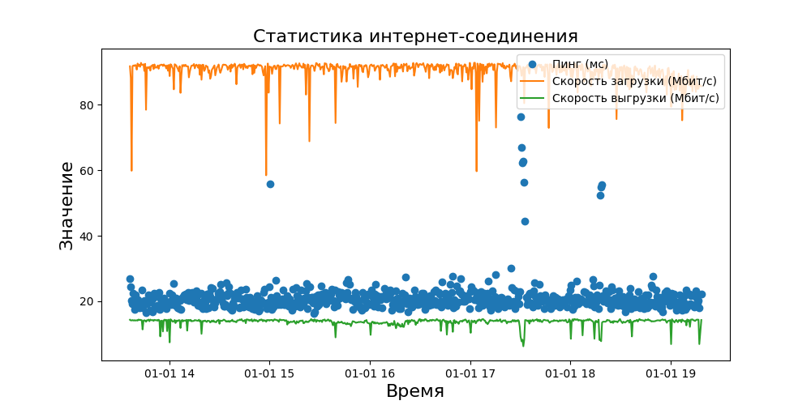
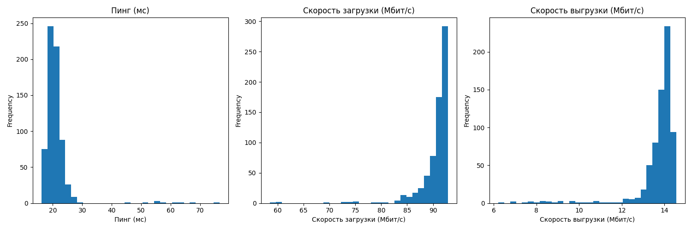

# Анализ параметров интернет-соединения

## Описание
Этот проект анализирует параметры интернет-соединения, включая пинг, скорость загрузки и скорость выгрузки. Данные загружаются из CSV-файла, проходят предварительную обработку, а затем анализируются. Цель проекта — предоставить статистический анализ параметров интернет-соединения, включая средние значения, стандартное отклонение, а также визуализацию этих параметров во времени и их распределение.

## Функционал
- Загрузка и предварительная обработка данных из CSV-файла.
- Очистка данных от пропущенных значений.
- Преобразование строковых значений в числовой формат для анализа.
- Статистический анализ параметров интернет-соединения.
- Визуализация параметров интернет-соединения во времени.
- Визуализация распределения параметров интернет-соединения.

## Зависимости
Для работы программы необходимы следующие библиотеки:
- `pandas`
- `matplotlib`
- `numpy`

## Установка и запуск проекта
1. Клонируйте репозиторий:
```
git clone https://github.com/Sogato/BDA-lab6.git
```
2. Создайте виртуальное окружение:
```
python -m venv env
```
3. Установите зависимости проекта:
```
pip install -r requirements.txt
```
4. Запустите программу:
```
python main.py
```

## Пример использования
После запуска программы в консоли будет представлен статистический анализ параметров интернет-соединения. В директории проекта будут сохранены изображения с визуализацией результатов анализа:
- `internet_connection_stats.png` — график параметров интернет-соединения во времени.
- `internet_connection_histograms.png` — гистограммы распределения параметров интернет-соединения.

## Визуализация результатов
### График параметров интернет-соединения


### Гистограммы параметров интернет-соединения


Эти графики показывают статистический анализ и распределение параметров интернет-соединения, включая пинг, скорость загрузки и скорость выгрузки.

---

Подготовлено в рамках учебного проекта. Все данные взяты из открытых источников и использованы исключительно в образовательных целях.

---

## Контрольные вопросы

### 1. Какие типы были у записей в df_compact до преобразования?
Типы записей в `df_compact` до преобразования в числовые значения были следующими:
- `Ping (ms)`: строка (`str`), так как значения представлены в кавычках.
- `Download (Mbit/s)`: строка (`str`), по той же причине.
- `Upload (Mbit/s)`: строка (`str`), аналогично предыдущим.
- `Date`: строка (`str`), представляющая дату.
- `Time`: строка (`str`), представляющая время.

### 2. В какое время наблюдалась максимальная и минимальная скорость загрузки, выгрузки данных, задержки отправки эхо-запросов командой ping?
Максимальная и минимальная скорость загрузки, выгрузки данных, а также задержка отправки эхо-запросов командой ping наблюдались в следующее время:

- **Максимальная скорость загрузки** наблюдалась в `17:02:49`, со скоростью `92.87 Мбит/с`.
- **Минимальная скорость загрузки** наблюдалась в `14:57:55`, со скоростью `58.48 Мбит/с`.


- **Максимальная скорость выгрузки** наблюдалась в `18:02:15`, со скоростью `14.55 Мбит/с`.
- **Минимальная скорость выгрузки** наблюдалась в `17:31:47`, со скоростью `6.21 Мбит/с`.


- **Максимальный пинг** наблюдался в `17:30:06`, с задержкой `76.528 мс`.
- **Минимальный пинг** наблюдался в `15:26:20`, с задержкой `16.167 мс`.

### 3. Каким получился результат корреляционного анализа?
В предоставленной работе корреляционный анализ не применялся. 

### 4. Каков точный формат задания подписей к осям графика, наименования графика, добавления легенды для выводимых на график величин?
Для задания подписей к осям графика, наименования графика и добавления легенды используются следующие команды в библиотеке `matplotlib`

- **Подписи к осям:**
```python
ax.set_xlabel('Ваша подпись оси X', fontsize=16)
ax.set_ylabel('Ваша подпись оси Y', fontsize=16)
```

- **Наименование графика:**
```python
ax.set_title('Наименование вашего графика', fontsize=16)
```

- **Добавление легенды:**
```python
ax.legend()
```

### 5. Какие еще библиотеки применяются для визуализации данных Python, назовите и кратко опишите пять таких библиотек.
В Python существует множество библиотек для визуализации данных. Помимо `matplotlib`, вот пять других популярных библиотек:

1. **Seaborn**: Библиотека построена на основе `matplotlib` и предназначена для создания статистических графиков. Она предлагает более высокоуровневый интерфейс и лучшую интеграцию с pandas DataFrame.

2. **Plotly**: Интерактивная библиотека для создания графиков, которая позволяет создавать сложные визуализации, включая 3D-графики и географические карты. Графики Plotly могут быть встроены в веб-приложения и Jupyter notebooks.

3. **Bokeh**: Предоставляет интерактивные графики и дашборды, которые можно встроить в веб-браузеры. Отличается высокой масштабируемостью и удобством использования для веб-проектов.

4. **Altair**: Декларативная статистическая визуализационная библиотека для Python. Altair строит графики на основе спецификации Vega и Vega-Lite и обладает простым и интуитивно понятным синтаксисом.

5. **ggplot**: Основана на ggplot2 для R, использует грамматику графики для создания сложных визуализаций. Подходит для тех, кто знаком с ggplot2 и ищет похожий опыт в Python.

Каждая из этих библиотек имеет свои уникальные особенности и лучше подходит для определенных типов задач визуализации данных.
